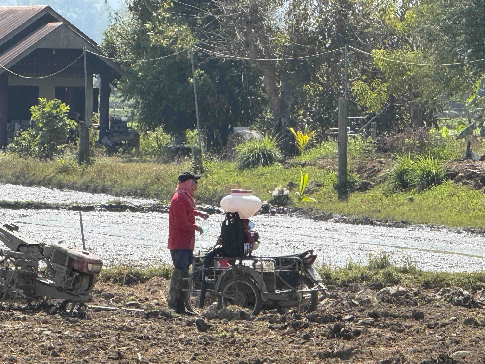

# 20250126_chiangrai

<html>
<head>

<meta charset="UTF-8">
<meta http-equiv="Content-Type" content="text/html; charset=UTF-8">
<meta http-equiv="X-UA-Compatible" content="IE=EmulateIE10" />
<meta http-equiv="X-UA-Compatible" content="IE=edge">

<!--ここから上はお決まりの定型文です-->

<!--ここからが表現の書式などを決めるcssという部分-->

<link href="https://cdnjs.cloudflare.com/ajax/libs/lightbox2/2.7.1/css/lightbox.css" rel="stylesheet">

</head>

<body>

モバイル端末をお使いの場合は、画面を横向きにすると
より見やすくご覧頂けます。

<!--ここ上は、ほぼそのまま使います！-->

<!--QRコードの挿入例-->

 アクセス用QRコード

<marquee direction="left" scrollamount="20" width="30%">(^_^)/~alis</marquee>

<!--流れ文字の挿入例-->
<h1><marquee behavior="left">!!! 2025/01/26、月はかなり細いので夜明け前に撮影、猫ちゃんシャンプーして最後は夕焼けグラデーション!!!</marquee></h1>

                          

<!--ここから下が、本体部分-->

<h2>夜明け前にさそり座と細い月を見つけます 26日 朝5:37</h2>

<h2>さそり座のトレースとお月さま</h2>

<h2>夜明け後はもう見つけるのが難しい細さでした</h2>

<h2>庭のお花もお目覚め</h2>

<h2>お腹が大きくなり始めた猫ちゃん</h2>

<h2>朝焼けグラデーション、月も映っていますが見えませんね？ 画面中央、ちょっと右です</h2>

<h2>お昼はいつもの親戚にご馳走になりました</h2>

<h2>裏の田んぼでは2期作目の田植えが始まっていました</h2>

<h2>足元には陽射しを浴びて鮮やかなお花</h2>

<h2>お隣さんの洗車はボンネット開けて中までジャブジャブ タイ仕様って耐水性あげてたっけ？</h2>

<h2>洗車後はそのままの勢いで庭に水やり</h2>

<h2>牛の放牧地はかなり縮小</h2>

<h2>青空の広さは羨ましいですね～</h2>

<h2>さっき洗車してたと思ったら、今度は重機で地ならしです</h2>

<h2>何と、親戚が新築するための地ならしでした</h2>

<h2>トラックが土をどんどん搬入します</h2>

<h2>一台づつ賃金直接払い、このドライバーは女性でした</h2>

<h2>洗車してたお兄ちゃんはトラックの誘導係に</h2>

<h2>こちらの離れでベランダをお借りして、しばし涼ませていただきました</h2>

<h2>お昼の後に市場の横の個人商店に立ち寄ると、市価の半額で物干しキャリア 笑顔になると前歯がほぼ無いおじいちゃんでした</h2>

<h2>この方、バイクのパンク修理をしてました</h2>

<h2>物干しキャリア、車に入らないというと、バラしてあげるからとのこと 念の為ネジ部の写真撮影</h2>

<h2>店の横には綺麗な仏壇</h2>

<h2>老眼鏡かけてネジばらししてくれてます</h2>

<h2>手作り感が伝わるちりとりも80バーツで購入、既製品の約1/3の価格</h2>

<h2>買い物が終わったので、シャンプーで預けていた猫を引き取りに</h2>

<h2>ふと横の木を見ると、根本のところに何かあります</h2>

<h2>こちらも綺麗に祀られた仏壇でした</h2>

<h2>ペットショップに西陽が当たって鮮やか</h2>

<h2>向かい側はオシャレなレストランでした</h2>

<h2>猫ちゃんはシャンプーしてスッキリでくつろぎモードに</h2>

<h2>今日も綺麗な日没が始まりました</h2>

<h2>ちびちゃんは日没よりも怪獣遊び</h2>

<h2>今日は少し少なめに、色の変化を追いました</h2>

<h2>今夜のBGMは、ちょっと元気にこちら</h2>
<iframe width="560" height="315" src="https://www.youtube.com/embed/7kE9BkfuvZY?si=cdnty8A6td1eJdpM" title="YouTube video player" frameborder="0" allow="accelerometer; autoplay; clipboard-write; encrypted-media; gyroscope; picture-in-picture; web-share" referrerpolicy="strict-origin-when-cross-origin" allowfullscreen></iframe> 

   
<h2>以上、夜明け前のさそり座とお月様からスタート。 親戚宅でお昼を頂いてから猫のシャンプーして最後は夕焼けグラデーション。 ここまで観ていただきありがとうございました。</h2>

     
<h2>
<a href="https://torokoid.github.io/20241126_chiangrai/" target="_blank">Back to the menu page</a>
</h2>

   

         

  

      

<!--本体はここまで-->

<!--画面に空白地帯を作って、背景が見えるようにしています-->
                                              

<!-- フッタ -->
<footer>

Copyright 2025/01/27 alis @ChiangRai

</footer>

<!--HPにさまざまなJavaScriptを呼び込むための書式-->

